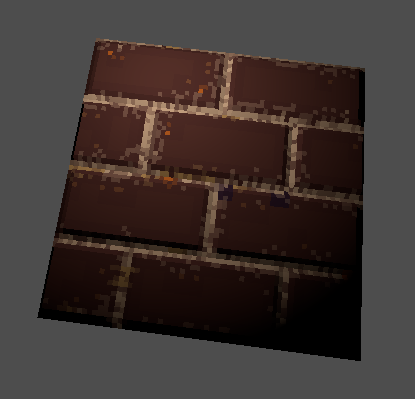

# Normal map from height map
Script for [Aseprite](https://www.aseprite.org/).
[This guide](https://www.aseprite.org/docs/scripting/) tells you where to put the script.

> Example when importing texture into [Godot engine](https://godotengine.org/)
